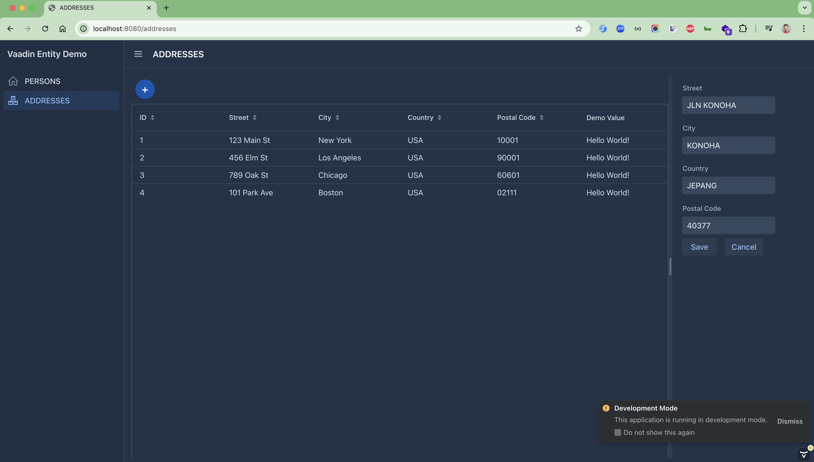

# spring-boot-vaadin-grid-form-entities

### Things todo list

1. Clone this repository: `git clone https://github.com/hendisantika/spring-boot-vaadin-grid-form-entities.git`
2. Navigate to the folder: `cd spring-boot-vaadin-grid-form-entities`
3. Run the application: `mvn clean spring-boot:run`
4. Open your favorite browser: http://localhost:8080

### Image Screenshot

Person UI

Address UI

